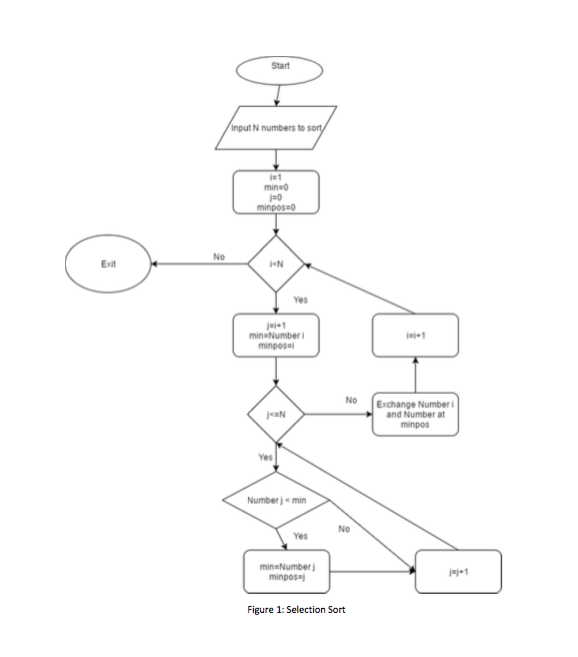
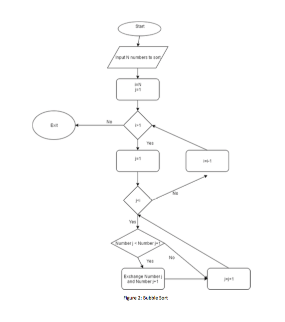

# Databases

## Lab 1 - January 10th, 2017

### SqLite

How we access data is we use these things called queries. 

In the terminal type in:

```bash
sqlite3

and then

.read FILENAME.sql

and then

select * from characters;
```

Order matters when running `select` in the terminal from the database. It is not case sensitive.

**Ex.** You can use FROM, ChaRacters, Select, ect. 

`select dinstinct` Applies only to what follows, and makes it so only unique data gets return. 
 
 ```sql
 select distinct title from characters;
 ``` 

**Notes:** You can have an or in your where.

```sql
 select * from characters where title = 'Horton Hears a Who' or title = 'Horton Hatches the Egg';
```
 
**Ex.** You can order your return. 
 
 ```sql
 select name, year from characters order by year, title;
 ```
 
### Aggregate function

* count
* max
* min
* avg

## Lab 2 - January 17th, 2017

### Flowcharts

* Rounded Rectangle -> Start and Stop
* Rectangle -> Process
* Diamond -> Decision
	* Yes or No
* Italic Rectangle -> Data Input or Output

### Communicate an algorithm 

* Easy 
* Visual
* Simple for hard problems

### Criteria for lab assignment 

* Flowchart: 
    * Draw by hand **or** 
    * Draw with https://draw.io

#### You should know how to: 

* Convert Pseudocode to Flowchart and Flowchart to Pseudocode

**Lab Exercise:** Draw a flowchart for playing 1 turn of "computer pictionary"

* 2 teams (Team A and B)
* Only using names of movies
* Computer draws movie name (if it can)
* 5 guesses

N.B. Team A draws a name -> Team A inputs name into computer -> Team B guesses (Max. 5 times)

**My Solution:**


**Group Solution:**


**PseudoCode Exercise:** Get the name and title of books where there is a 1 and the year in lesser than 1960

Table 1: Characters

| name     | title    | year | human |
| --------:| --------:| ----:| -----:|
| example  | example  | 1983 | 1     |
| example2 | example2 | 1924 | 0     |
| example3 | example3 | 1999 | 1     |

Answer:  `Select name, title from characters where human=1 and year<1960`

## Lab 3 - January 24th, 2017

### Hex to Binary To Decimal

| Dec | Hex | Binary |
| ---:| ---:| ------:|
|    0|    0|    0000|
|    1|    1|    0001|
|    2|    2|    0010|
|    3|    3|    0011|
|    4|    4|    0100|
|   10|    A|    1010|
|   11|    B|    1011|
|   12|    C|    1100|
|   13|    D|    1101|
|   14|    E|    1110|
|   15|    F|    1111|

### Binary to Hex

|0010|1101|1111|
|---:|---:|---:|
|   2|   D|   F|

### Hex to Dec

|    2|     D|     F|
|----:|-----:|-----:|
|16(2)| 16(1)| 16(0)|

= Big Number

### 2's compliment

**Note:** Number of bits need to be even

**Ex:** Positive number in 2's complement

+28 = 28 in binary

## Lab 4 - January 31st, 2017

* OR (+)

* And (*)
  
* XOR (circleX)
* Not (~)


Truth Tables -> Circuit Diagram 

A) Draw a diagram of an OR gate using only AND and NOT gates. 

B) Draw a circuit diagram for an AND gate using only OR and NOT gates.

#### The "OR and ANDS" Rule
OR, AND, NOT gates

|A   |B   |C   |
| --:| --:| --:|
|0   |0   |0   |
|0   |1   |1   |
|1   |0   |0   |
|1   |1   |1   |

1. Look at only to inputs with 1 output. 
2. A is 0 -> Not gate
3. B is 1 -> Nothing
4. an AND those two
5. A is 1 -> Nothing
6. B is 1 -> Nothing
7. and AND those two
8. put both those paths to an OR gate

---

**Note:** Doing AND for two inputs and then AND that input with a third input is the same as AND for three inputs. 

## Lab 5 - February 7th, 2017

#### Sorting

Selection Sort vs. Bubble Sort

**Selection Sort**

List of numbers [64, 25, 12, 22, 11]

```
n=5
min position = "position of min"
min = "min for index i"
i = "index for next sorted number"
j = "index to compare as next min"

1. Look at index 1
2. Find the lowest number in the list and switch it with the first position.

[11, 25, 12, 22, 64]

1. Look at index 2
2. Find the new min
3. Is the number lower than that of index 2

[11, 12, 25, 22, 64]

ect. 

[11, 12, 22, 25, 64]

1. Look at the last two in the array
```




**Bubble Sort**

List of numbers [5, 1, 4, 2, 8]

```
n=5
i = N
j = ""

```



Wikipedia page on bubble sort