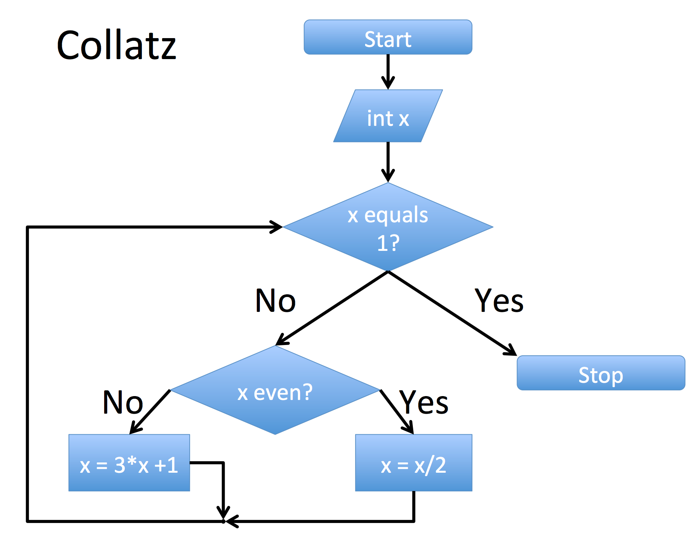
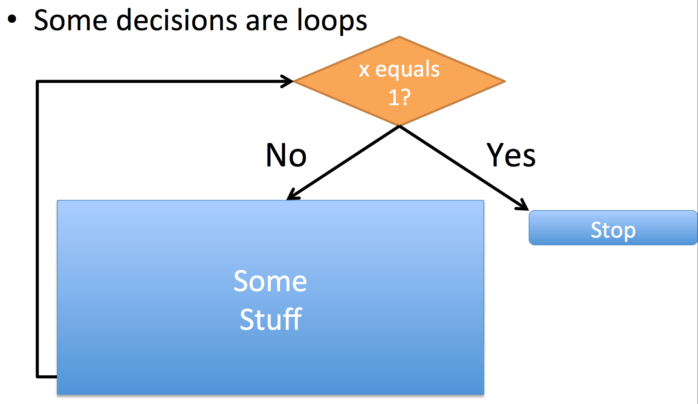

## Lecture 17 - February 21st, 2017

### Python Programming

* You can install python on your own computer.
* To execute a program: 
    * python <file_name.py>

**print:** is a function and strings are surrounded by quotes ""

**Function:** is a block of code that is grouped together

* The name makes it easy to execute
    * Otherwise we'd have to copy and paste the same code multiple times
* Functions help organize
* Name Flowchart
* Functions can input values and return values
* We can write our own
* "def" to signal we are about to define a function
* Input parameters are in parenthesis, followed by colon
* All code in the function is indented.

**Variables:** name for a value, can change, variable is like a box

ex. 

```python
x = 5
```

**Comments:** Allows us to document our code

* Leave notes to you and others (not the computer)

ex.
 
```python
# Here's a comment
x = 5
# Hey! Comment
```

Collatz: 



**Syntax:**

* After every decision you must ":" and indent (This tells python which code belongs to the yes/no part if the decision)

ex. 

```python
if x % 2 == 0:
    x = x/2
else:
    x = x*3+1
```

**Check equality:** "=="
**Assign value:** "="



ex. 

```python
while x > 1
    print("The number is %i" % x)
    
    if x % 2 == 0:
        x = x/2
    else:
        x = x*3+1 
```

Nesting ^^

ex. Collatz Example

```python
# This tells python to load a library called "time"
# Which we will use for pauses in the loop
import time

x = 5

# Keep track of the number of times through the list
loop_count = 0
# "while" is like "repeat until" in scratch, but the while loop continues until the condition is FALSE, repeat until ends once the condition is TRUE.
while x > 1:
	print("The number is %i" % x)
	time.sleep(1) # this waits 1 second to slow down the prints
	if x % 2 == 0:
		x = x/2
	else:
		x = x*3+1
	loop_count = loop_count + 1

print("Done!  It took me %i loops" % loop_count)
```

ex. Errors

```python
print(test)

5 = x

print("thry this)

print("try test"

myVar = 5
print(myvar)
```

**Google the error, and most code will return where the error is found.** 

ex. 

```python
def myFunction(my_number):
    if my_number % 2 == 0:
        print("Even!")
    else:
        print("Odd!")
    
```

**Call the function by calling it's name**

ex. `myFunction(10)`

ex. Functions can call other functions

```python
def isEven(my_number):
    result = False
    if my_number % 2 == 0:
        return = True
    return result
    
def callFunction(my_number2):
    if isEven(my_number2):
        print("Even!")
    else:
        print("Odd!")
```

#### Recommend: 
* Tutorial 
* http://cscircles.cemc.uwaterloo.ca/
