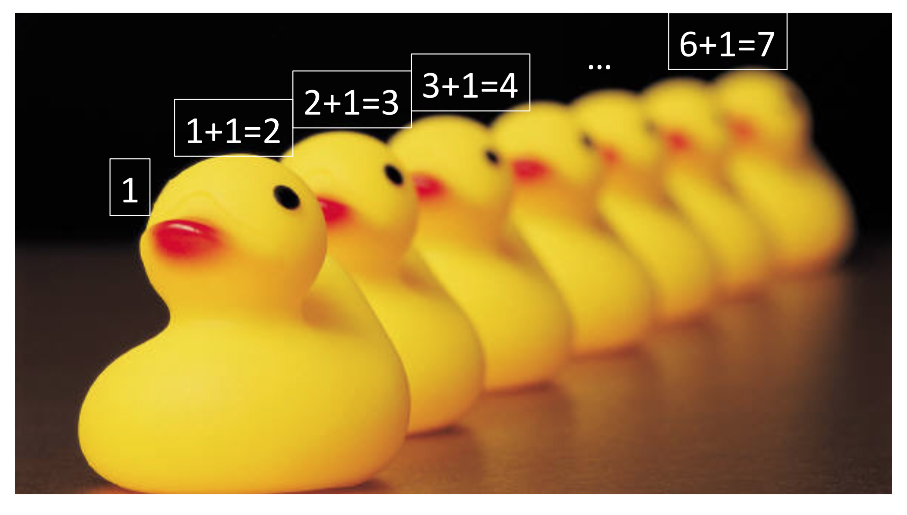

## Lecture 22 - March 8th, 2017

### Recursion

How many ducks in your row?


The big problem is counting all of the ducks in the line.
The smaller problem is counting the ducks ahead of me in line. 

**Solution:** I can just add one (the count for myself) to that number. The easiest case (base case) is the case when there are no ducks ahead of me in line. 




**Recursion Requires**

* A base case
    * The simplest case, usually very easy to compute
    * “If there’s no one in front of me, then there is only one person (me) in front of the person behind me”
* A method of compu1ng a full solu1on from solu1ons to sub-problems
    * “If I know the number of people in front of me in line, I can tell the person behind me how many people are in front of him”

**Code**

```python
def callMyself(num):
    if num > 0:
        print "Hi "+str(num)
        callMyself(num-1)
    else: 
        #Base case
        print "Bye"

callMyself(5) 
```

**Output**

```
Hi 5
Hi 4
Hi 3
Hi 2
Hi 1
Bye
```

**Code**

```python
def callMyself(num):
    if num > 0:
        print "Hi "+str(num)
        callMyself(num-1)
    else: 
        #Base case
        print "Bye"
    print "Test"

callMyself(5) 
```

**Output**

```
Hi 5
Hi 4
Hi 3
Hi 2
Hi 1
Bye
Test
Test
Test
Test
Test
Test
```

Ex. Factorial
 
$ 5! = 5*4*3*2*1 $

What's the base case?

$ 1! $

What's the recursive case?

$ n-1! $

**Note:** Always start with your base case.

**Code**

```python
def factorial(n):
    if n == 1:
        return 1
    else:
        r = factorial(n-1)
        return r * n
        
print factorial(5)
```

**Output**

```
120
```

## Leture 24 - March 14th, 2017

Factorial problem:

**Code**

```python
def factorial(n):
    if n == 1:
        return 1
    else:
        r = factorial(n-1)
        return r * n

print factorial(5)
```

**Output**

```
factorial(5)
    n = 5
    r = factorial(n-1) 
    r = factorial(4)

factorial(4)
    n = 4
    r = factorial(n-1) 
    r = factorial(3)
    
factorial(3)
    n = 3
    r = factorial(n-1) 
    r = factorial(2)
    
factorial(2)
    n = 2
    r = factorial(n-1) 
    r = factorial(1)

factorial(1)
    n = 1
    return 1
    
factorial(2)
    n = 2
    r = factorial(n-1) 
    r = factorial(1)
    r = 1
    return r * n
    return 2
    
factorial(3)
    n = 3
    r = factorial(n-1) 
    r = factorial(1)
    r = 2
    return r * n
    return 6
    
factorial(4)
    n = 4
    r = factorial(n-1) 
    r = factorial(1)
    r = 6
    return r * n
    return 24

factorial(5)
    n = 5
    r = factorial(n-1) 
    r = factorial(1)
    r = 24
    return r * n
    return 120
    
print -> 120
```

**Code**

```python
def factorial(n):
    print n
    if n == 1:
        return 1
    else:
        r = factorial(n-1)
        print r * n
        return r * n

print factorial(3)
```

**Output**

```
factorial(3)
  print -> 3
  n = 3
  r = factorial(n-1)
  r = factorial(2)

factorial(2)
  print -> 2
  n = 2
  r = factorial(n-1)
  r = factorial(1) 

factorial(1)
  print -> 1
  n = 1
  return 1
  
factorial(2)
  n = 2
  r = factorial(n-1)
  r = factorial(1) 
  print -> 2
  return r * n
  return 2

factorial(3)
  n = 3
  r = factorial(n-1)
  r = factorial(2) 
  print -> 6
  return r * n
  return 6
  print -> 6
```
