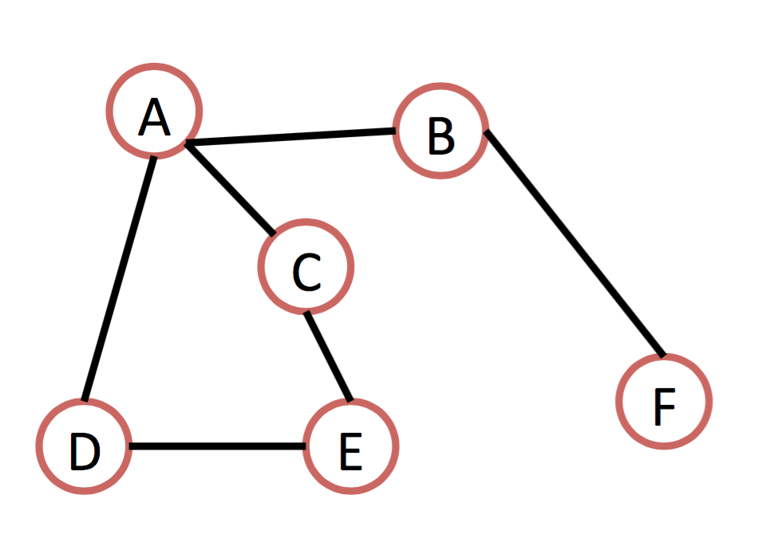
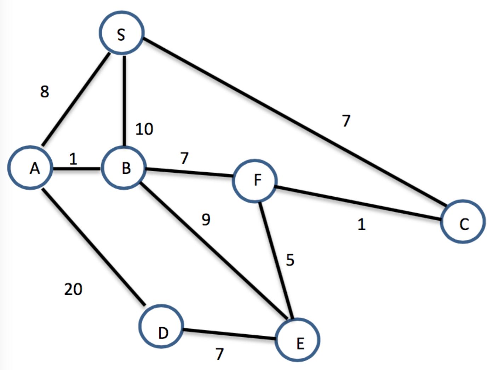

## Lecture 24 - March 14th, 2017

### Graph Algorithms

#### What is a graph?

* A graph is a mathematical tool used to represent a structured system
* It is made up of
    * Node or Vertices (circles)
    * Edges (lines)

* Graphs can have
    * Paths
        * There is a path from A to F 
    * Cycles
        * A path that loops back on itself
* Nodes can have
    * Neighbours
        * Connected via edge

* Graphs are useful for representing multiple real world problems
    * Social networks 
    * Internet
    * Power grids
* Google's Page rank algorithm uses a graph that represents the entire internet, and the links between pages. 

* Some graphs are trees
    * A graph is a tree if it contains no cycles

#### Graph Algorithms

* Searching: visit all node of a graph
    *  Breadth first search (BFS)
        * Use a queue
    * Depth first search (DFS)
        * Use a stack    

#### Queue vs stack

* Queue 
    * Like a line at the grocery store
        * First in first out (FIFO) 
* Stack
    * Like a stack of waffles
        * First in last out (FILO) 

#### Depth first search

* Put start a node in stack, add to result, mark it as visited
* While stack is not empty
    * Look at node at top of stack, call it V
    * If V has unvisited neighbours:
        * Select alphabeticallyy next unvisited neighbour, call it U
            * Add U to reseult
            * Mark U as visited
            * add U to stack
        * Else remove V from stack

**Example:** 

             
Stack -D- -> -E- -> -C- -> -F- -> -B- -> -A-

Result: A B F C E D

Visited: -A- -B- -C- -D- -E- -F-

#### Breadth First Search

* Put start node in queue, add to result, mark as visited
* While queue is not empty:
    * Remove first node from queue, call it V, the current working node
    * For all neighbors U of V, in alphabe2cal order:
        * If U is unvisited:
            * Add U to result
            * Mark U as visited
            * Add U to queue

**Example:** 

Queue -A- -B- -C- -D- -F- -E-

Result A B C D F E

Visited -A- -B- -C- -D- -E- -F-

## Lecture 25 - March 15th, 2017

#### Dijkstra's Shortest Path Alg

* Given a graph with weighted edges
    * i.e. each edge has an associated number (weight)
* Find the shortest path from tart node "S" to every other node in the graph. 

* To start: distance from start S to self is 0, and previous node is N/A, all other distances ∞
* While there are no unprocessed nodes
    * Choose the unprocessed node U with smallest distance D to start node, break 2es with alphabe2cal order
    * For all neighbors V of U
        * If (best dist S -> V) > ( D + distance U->V)
            * Set best dist S -> V = (D + distance U->V)
            * Set prev node for V to U
    * Mark U as processed

**Example:** 

Current Vertex: 

Distance to start:

| Vertex | Processed? | Best know distance | Previous vertex |
|--------|------------|--------------------|-----------------|
| S      |            |                    |                 |
| A      |            |                    |                 |
| B      |            |                    |                 |
| C      |            |                    |                 |
| D      |            |                    |                 |
| E      |            |                    |                 |
| F      |            |                    |                 |

---

Current Vertex: Init

Distance to start:

| Vertex | Processed? | Best know distance | Previous vertex |
|--------|------------|--------------------|-----------------|
| S      |      x     |          0         |       N/A       |
| A      |      x     |      Infinity      |                 |
| B      |      x     |      Infinity      |                 |
| C      |      x     |      Infinity      |                 |
| D      |      x     |      Infinity      |                 |
| E      |      x     |      Infinity      |                 |
| F      |      x     |      Infinity      |                 |

---

Current Vertex: S

Distance to start: 0

| Vertex | Processed? | Best know distance | Previous vertex |
|--------|------------|--------------------|-----------------|
| S      |      ✓     |          0         |       N/A       |
| A      |      x     |          8         |        S        |
| B      |      x     |         10         |        S        |
| C      |      x     |          7         |        S        |
| D      |      x     |      Infinity      |                 |
| E      |      x     |      Infinity      |                 |
| F      |      x     |      Infinity      |                 |

|   | Distance U -> V | Best Distance |
|---|-----------------|---------------|
| A | 8               | Infinity      |
| B | 10              | Infinity      |
| C | 7               | Infinity      |

---

Current Vertex: C

Distance to start: 7

| Vertex | Processed? | Best know distance | Previous vertex |
|--------|------------|--------------------|-----------------|
| S      |      ✓     |          0         |       N/A       |
| A      |      x     |          8         |        S        |
| B      |      x     |         10         |        S        |
| C      |      ✓     |          7         |        S        |
| D      |      x     |      Infinity      |                 |
| E      |      x     |      Infinity      |                 |
| F      |      x     |          8         |        c        |

|   | Distance U -> V | Best Distance |
|---|-----------------|---------------|
| S | 7               | 0             |
| F | 1               | Infinity      |

---

Current Vertex: A

Distance to start: 8

| Vertex | Processed? | Best know distance | Previous vertex |
|--------|------------|--------------------|-----------------|
| S      |      ✓     |          0         |       N/A       |
| A      |      ✓     |          8         |        S        |
| B      |      x     |          9         |        A        |
| C      |      ✓     |          7         |        S        |
| D      |      x     |         28         |        A        |
| E      |      x     |      Infinity      |                 |
| F      |      x     |          8         |        C        |

|   | Distance U -> V | Best Distance |
|---|-----------------|---------------|
| S | 8               | 0             |
| B | 1               | 10            |
| D | 20              | Infinity      |

--- 

Current Vertex: F

Distance to start: 8

| Vertex | Processed? | Best know distance | Previous vertex |
|--------|------------|--------------------|-----------------|
| S      |      ✓     |          0         |       N/A       |
| A      |      ✓     |          8         |        S        |
| B      |      x     |          9         |        A        |
| C      |      ✓     |          7         |        S        |
| D      |      x     |         28         |        A        |
| E      |      x     |         13         |        F        |
| F      |      ✓     |          8         |        C        |

|   | Distance U -> V | Best Distance |
|---|-----------------|---------------|
| B | 7               | 9             |
| C | 1               | 7             |
| E | 5               | Infinity      |

---

Current Vertex: B

Distance to start: 9

| Vertex | Processed? | Best know distance | Previous vertex |
|--------|------------|--------------------|-----------------|
| S      |      ✓     |          0         |       N/A       |
| A      |      ✓     |          8         |        S        |
| B      |      ✓     |          9         |        A        |
| C      |      ✓     |          7         |        S        |
| D      |      x     |         28         |        A        |
| E      |      x     |         13         |        F        |
| F      |      ✓     |          8         |        C        |

|   | Distance U -> V | Best Distance |
|---|-----------------|---------------|
| S | 10              | 0             |
| A | 1               | 8             |
| F | 7               | 8             |
| E | 9               | 13            |

---

Current Vertex: E

Distance to start: 13

| Vertex | Processed? | Best know distance | Previous vertex |
|--------|------------|--------------------|-----------------|
| S      |      ✓     |          0         |       N/A       |
| A      |      ✓     |          8         |        S        |
| B      |      ✓     |          9         |        A        |
| C      |      ✓     |          7         |        S        |
| D      |      x     |         20         |        E        |
| E      |      ✓     |         13         |        F        |
| F      |      ✓     |          8         |        C        |

|   | Distance U -> V | Best Distance |
|---|-----------------|---------------|
| B | 9               | 9             |
| F | 5               | 8             |
| D | 7               | 28            |

---

Current Vertex: D

Distance to start: 20

| Vertex | Processed? | Best know distance | Previous vertex |
|--------|------------|--------------------|-----------------|
| S      |      ✓     |          0         |       N/A       |
| A      |      ✓     |          8         |        S        |
| B      |      ✓     |          9         |        A        |
| C      |      ✓     |          7         |        S        |
| D      |      ✓     |         20         |        E        |
| E      |      ✓     |         13         |        F        |
| F      |      ✓     |          8         |        C        |

|   | Distance U -> V | Best Distance |
|---|-----------------|---------------|
| A | 20              | 8             |
| E | 7               | 13            |

---

Solution: 

E <- F <- C <- S

D <- E <- F <- C <- S

---

[Video for Review](hdps://www.youtube.com/watch? v=8Ls1RqHCOPw)

* Each row in video corresponds to one of our tables
* Highligh2ng is the same as checking a row in col 2
* Col 3 and 4 are what get wriden in each col of a row in the video.
s
