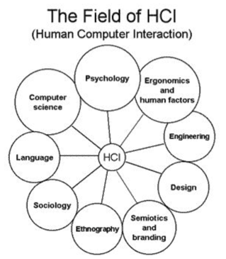
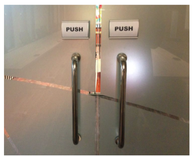

## Lecture 14 - February 7th, 2017

### Guest Lecture 3

#### What is HCI

**An introduction to human computer interaction (SENG 310) - David Johnson**

Vitural Reality - Human interaction

* The study of the interactions between people and computer interfaces
* The process of designing and buildig software that is **usable**, **useful**, and **enjoyable**

#### Why should we study HCI?

#### What is an interface?

* A boundary where two systems / subjects / things meet to exchange information

**Interface Examples:**

* Google Search
* Apple Watch
* Amazon Echo

**Bad Interfaces:**

* Lock -> (Door Signage)
* Knobs and Burner

#### Principles of Good Design

* Robin Williams Book

**2 Important Aspects of Good Design:**

* Discoverability
* Understanding

**Norman's Deisgn Principles**

* Visibility
* Affordances & Signifiers
    * Ex. Faucets, Doors 
* Constraints
    * Reduce Errors 
* Mappings
    * Ex. Burner 
* Feedback
    * Satisfaction 
* Consistency

**Norman Doors**

#### Consequences of Bad Design

* Decrease adoption
* Decrease productibity
* Decrease employee morale
* Data loss

#### Goals of Good Design

* Usability
* User Experience

**Usability Goals:**

* Effectiveness
* Efficient
* Safety
* Utility
* Learnability
* Memorability
* **Note** These do not measure how well the user actually enjoys the experience...

**User Experience Goals:**

* Satisfaction
* Fun
* Helpful
* Motivating
* Rewarding
* A e s t h e t i c s

#### Interaction Deisgn

* Requirements Gathering
    * Don't listen to users
    * What they do, versus what they said
    * Gain empathy for the user
    * Questions (Users, Goals, ect.) 
* Conceptual Design
    * Model
        * Purpose statement, objects, operations, attribute, relationship  
    * Personas
        * Example 
    * Scenarios & Use Cases
* Concrete Design
    * Prototyping
    * Interactive Deisgn
    * Fidelity of prototypes (Low - Paper, High - Sketch / InVision) 
* Evaluation
    * Does it work?
        * Why, Who, When
        * Cognitive Walkthrough
        * 5 Steps of Usibility
        * 5 Users Min / Max - Interating  
* Repeat... 

**The user is drunk**

[Link to Video](https://www.youtube.com/watch?v=r2CbbBLVaPk&feature=youtu.be)